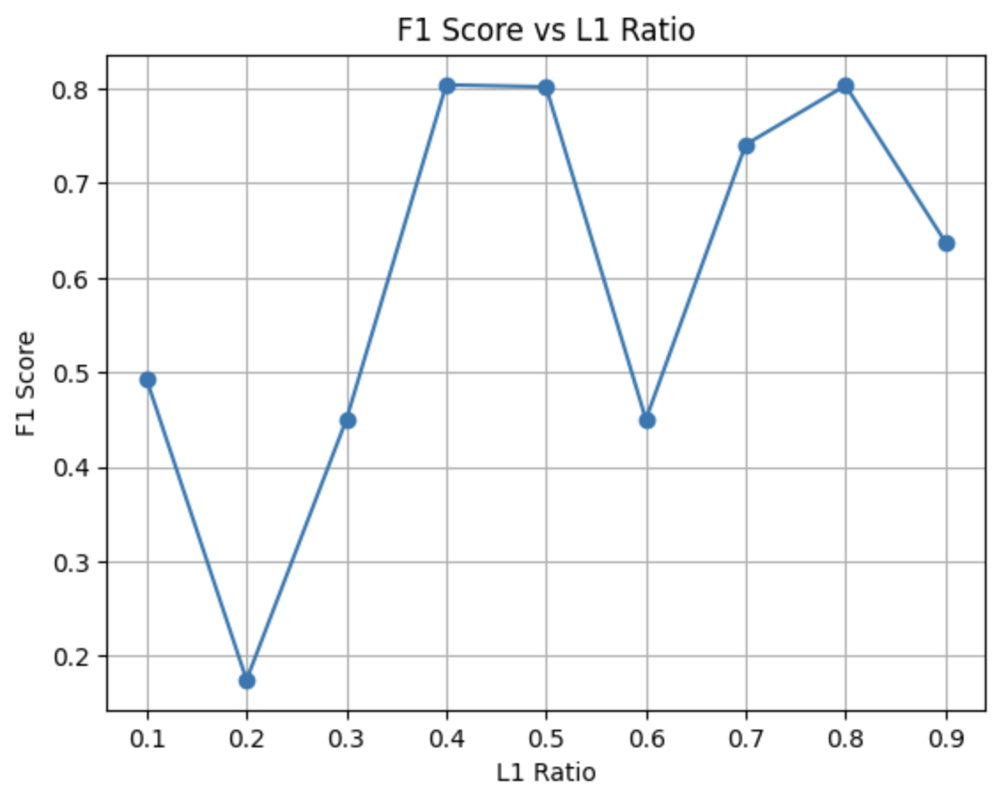

# Perceptron + Elastic Net Regularization Experiment

A simple machine learning experiment to understand how the **Elastic Net `l1_ratio`** affects the performance of a Perceptron classifier.

The goal of this project was not to obtain the highest accuracy, but to build intuition about how different regularization strengths influence model performance.

---

## Dataset

Placement Prediction Dataset

### Preprocessing

- Removed categorical features
- Removed irrelevant columns (Student ID)
- Used only numerical features
- Applied feature scaling before training

---

## Model

Scikit-Learn Perceptron

Regularization:
- Penalty = Elastic Net
- Different `l1_ratio` values were tested while keeping the remaining hyperparameters fixed.

Evaluation Metric:
- F1 Score

---

## Experiment

The model was trained multiple times while varying only the `l1_ratio`.

Values tested: 0.1,0.2,0.3,0.4,0.5,0.6,0.7,0.8,0.9

The resulting F1 scores were plotted to observe how Elastic Net regularization affects performance.

---

## Result

---

## Observations

- Very low `l1_ratio` values produced relatively poor performance.
- Increasing the L1 contribution significantly improved the F1 score.
- Best performance was observed around: l1_ratio ≈ 0.4 - 0.5
and
l1_ratio ≈ 0.8

- The relationship is **not monotonic**. Increasing the L1 ratio does not always improve performance.
- Intermediate values can sometimes outperform both extremes.

---

## What I Learned

This experiment helped me understand several important concepts:

### 1. Hyperparameters Matter

Changing a single hyperparameter can noticeably change model performance.

---

### 2. Elastic Net Balances L1 and L2

Elastic Net combines both regularization techniques.

- L1 encourages sparse weights (feature selection)
- L2 keeps weights small and stable

The `l1_ratio` controls the balance between them.

---

### 3. There is No Universally Best Regularization

The optimal regularization depends on the dataset.

Instead of assuming a value, we should tune it experimentally.

---

### 4. F1 Score is More Informative Than Accuracy

Since classification datasets can be imbalanced, F1 score provides a better picture by balancing precision and recall.

---

## Tech Stack

- Python
- NumPy
- Pandas
- Scikit-Learn
- Matplotlib

---

## Future Improvements

- Perform GridSearchCV over multiple hyperparameters
- Compare Elastic Net with pure L1 and pure L2 regularization
- Evaluate using cross-validation
- Visualize coefficient sparsity for different `l1_ratio`
- Compare against Logistic Regression and Linear SVM
